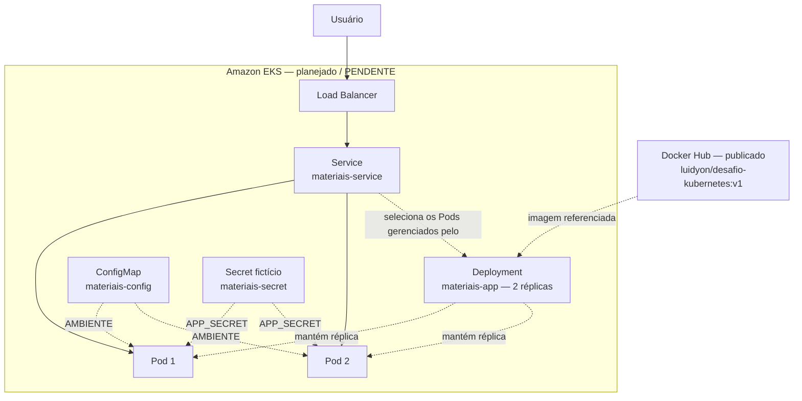
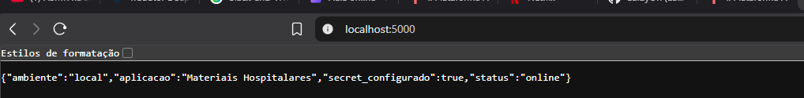
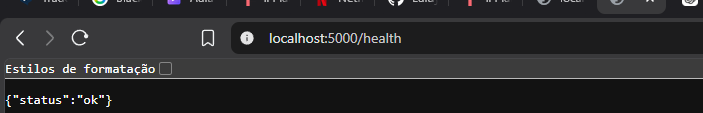
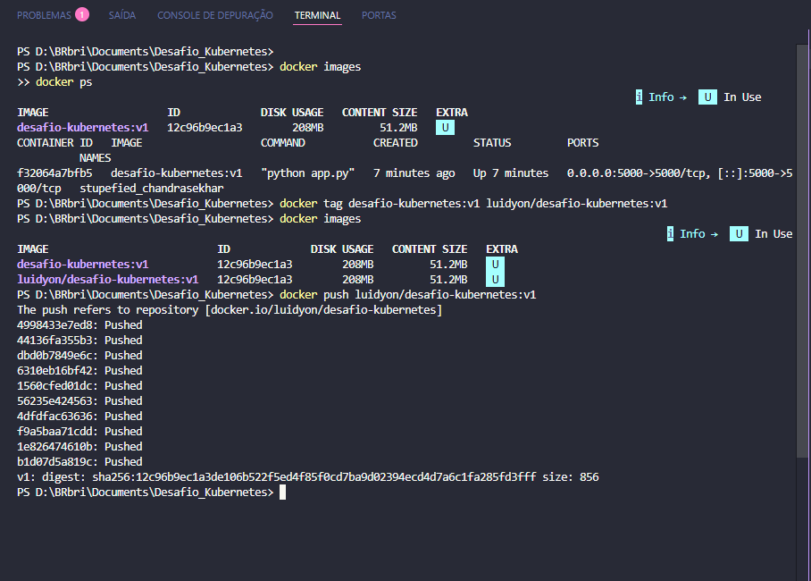
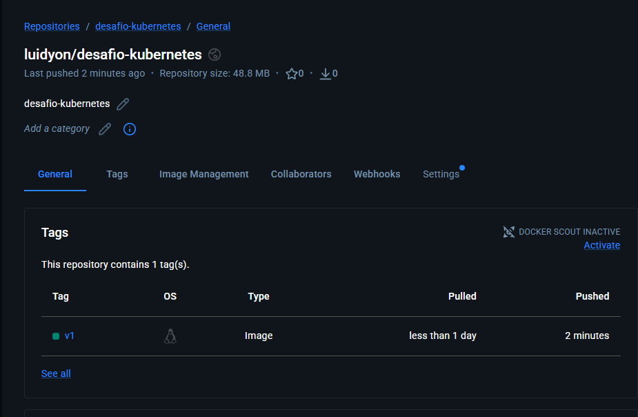

# Desafio Kubernetes — Da aplicação local ao Amazon EKS

Desafio Modular da disciplina **Computação em Nuvem e Orquestração com Kubernetes**.

**Estado atual:** Fase 1 e Fase 2 concluídas. **Fase 3 — Amazon EKS: PENDENTE.**
Os resultados locais foram validados manualmente; a implantação e os testes na AWS ainda não foram realizados.

## Objetivo

Demonstrar o fluxo de conteinerização e orquestração:

**Aplicação → Docker → Docker Hub → Amazon EKS → Deployment → Service → Acesso externo**

A aplicação funcional é propositalmente simples: uma API sobre materiais hospitalares, sem banco de dados nem regras de negócio. O foco do desafio é empacotar a aplicação com Docker e, na etapa futura, executá-la e gerenciar suas réplicas com Kubernetes.

## Aplicação

A aplicação usa **Python + Flask** e escuta na **porta 5000**.

| Item | Comportamento |
|---|---|
| `GET /` | Retorna o nome da aplicação, o ambiente, o status e a indicação de Secret configurado |
| `GET /health` | Retorna `{"status": "ok"}` para verificar a resposta da aplicação |
| `AMBIENTE` | Variável de ambiente; usa `local` como padrão e receberá `demonstracao` pelo ConfigMap no Kubernetes |
| `APP_SECRET` | Variável recebida em tempo de execução; a API informa apenas se ela foi definida |

**O conteúdo do Secret nunca é exposto nas respostas da aplicação.** Os exemplos deste repositório usam somente valores fictícios. A presença de `secret_configurado: true` no teste local confirma o recebimento de `APP_SECRET`, sem revelar seu conteúdo.

## Arquitetura

O diagrama representa a **arquitetura planejada para a Fase 3**. A imagem já foi publicada no Docker Hub; os recursos dentro do bloco Amazon EKS ainda não foram implantados.



O fluxo de acesso previsto é **Usuário → Load Balancer → Service → Pods**. O Deployment define e mantém as duas réplicas; ele não recebe tráfego HTTP. As setas pontilhadas indicam relações de gerenciamento, seleção e configuração.

## Estrutura do projeto

| Caminho | Descrição |
|---|---|
| `app/` | Código da aplicação (`app.py`) e dependência Flask (`requirements.txt`) |
| `k8s/` | Manifestos preparados para a futura implantação no Kubernetes |
| `k8s/configmap.yaml` | ConfigMap `materiais-config` com `AMBIENTE=demonstracao` |
| `k8s/secret.yaml` | Secret `materiais-secret` com o valor fictício `APP_SECRET=segredo-ficticio` |
| `k8s/deployment.yaml` | Imagem publicada, 2 réplicas, porta 5000 e referências ao ConfigMap e ao Secret |
| `k8s/service.yaml` | Service do tipo LoadBalancer, com porta 80 direcionada à porta 5000 dos Pods |
| `docs/evidencias/` | Capturas reais da atividade e índice das evidências |
| `docs/roteiro-documentacao.md` | Esqueleto para preenchimento da documentação acadêmica final |
| `Dockerfile` | Receita da imagem, baseada em `python:3.12-slim` |
| `.dockerignore` | Exclusões do contexto de build Docker |
| `.gitignore` | Exclusões do versionamento, incluindo ambientes Python e arquivos sensíveis |
| `.gitattributes` | Normalização automática dos arquivos de texto |
| `README.md` | Estado do projeto, comandos, resultados e próximos passos |

## Fase 1 — Preparação da aplicação

**CONCLUÍDA.**

- Aplicação Flask criada com os endpoints `GET /` e `GET /health`.
- Dockerfile criado para instalar as dependências e iniciar a aplicação na porta 5000.
- ConfigMap e Secret fictício preparados para fornecer as variáveis de ambiente.
- Deployment preparado com 2 réplicas, labels e selectors `app: materiais-app`.
- Service LoadBalancer preparado para expor a porta 80 e encaminhar para a porta 5000.

A conclusão desta fase corresponde à preparação dos arquivos. A aplicação dos manifestos no EKS permanece pendente.

### Execução local sem Docker — referência

Comandos para Windows/PowerShell, a partir da raiz do projeto:

```powershell
python -m venv .venv
.\.venv\Scripts\Activate.ps1
pip install -r app\requirements.txt

$env:AMBIENTE = "local"
$env:APP_SECRET = "valor-ficticio"
python app\app.py
```

Esta é uma alternativa de execução. As capturas desta atividade registram a validação local com Docker.

## Fase 2 — Docker e Docker Hub

**CONCLUÍDA.** A imagem foi construída, executada e publicada manualmente.

| Item | Valor |
|---|---|
| Imagem local | `desafio-kubernetes:v1` |
| Imagem publicada | `luidyon/desafio-kubernetes:v1` |
| Docker Hub | [luidyon/desafio-kubernetes](https://hub.docker.com/r/luidyon/desafio-kubernetes) |
| Tag | `v1` |

Uma **imagem Docker** reúne a aplicação e suas dependências. A **tag** identifica uma versão da imagem; neste projeto, `v1`. O **Docker Hub** é o registro que armazena a imagem publicada e a disponibiliza para download.

### Comandos usados

Registro dos comandos já executados em PowerShell, na raiz do projeto:

```powershell
docker build -t desafio-kubernetes:v1 .

docker run --rm -p 5000:5000 `
  -e AMBIENTE=local `
  -e APP_SECRET=valor-ficticio `
  desafio-kubernetes:v1
```

Com o container em execução, em outro terminal:

```powershell
docker images
docker ps

docker tag desafio-kubernetes:v1 luidyon/desafio-kubernetes:v1
docker push luidyon/desafio-kubernetes:v1
```

O comando de publicação está documentado como histórico da Fase 2. Nenhum novo push foi realizado nesta atualização do repositório.

## Resultados da validação local

Resultados da execução manual já concluída, conforme o relato da atividade e as capturas anexadas.

### GET /

Endereço: `http://localhost:5000/` — **HTTP 200**.

```json
{
  "ambiente": "local",
  "aplicacao": "Materiais Hospitalares",
  "secret_configurado": true,
  "status": "online"
}
```

`AMBIENTE` foi recebido como `local`. `APP_SECRET` também foi recebido, mas a resposta expõe somente a indicação booleana de que está configurado.

### GET /health

Endereço: `http://localhost:5000/health` — **HTTP 200**.

```json
{
  "status": "ok"
}
```

Para reproduzir a consulta e visualizar também o status HTTP, com a aplicação em execução:

```powershell
curl.exe -i http://localhost:5000/
curl.exe -i http://localhost:5000/health
```

As capturas do navegador mostram os corpos das respostas; o status HTTP 200 faz parte da validação manual informada. Essas evidências locais ainda não validam ConfigMap ou Secret dentro do Kubernetes.

## Evidências

As quatro capturas recebidas foram preservadas em [docs/evidencias](docs/evidencias/README.md). A captura do terminal reúne a listagem de imagens, o container em execução e o push; ela é apresentada uma única vez.

### Aplicação executada localmente



Comprova a resposta da aplicação na porta 5000, com `ambiente: local` e `secret_configurado: true`, sem expor o segredo.

### Health check



Comprova que `GET /health` respondeu com `status: ok` no ambiente local.

### Imagem, container e push Docker



Comprova a imagem `desafio-kubernetes:v1`, o container em execução com a porta 5000 publicada, a tag `luidyon/desafio-kubernetes:v1` e o push concluído com digest.

### Publicação no Docker Hub



Comprova a presença da tag `v1` no repositório `luidyon/desafio-kubernetes` do Docker Hub.

### Evidências ainda a coletar

- Para complementar o registro local: saídas dos comandos `docker build` e `docker run`, além de consultas que exibam explicitamente o HTTP 200. A execução já foi informada como concluída, mas essas saídas não aparecem nas capturas recebidas.
- Para a Fase 3: nós do cluster, Deployment aplicado, 2 Pods em execução, Service com endereço externo, respostas pela Internet, variáveis recebidas no Kubernetes, exclusão e recriação de Pod e remoção dos recursos AWS. Nenhuma dessas evidências foi produzida ainda.

## Fase 3 — Amazon EKS

**PENDENTE.** Esta seção é um roteiro para execução futura. Nenhuma etapa abaixo foi concluída e nenhum resultado de EKS está registrado.

### Preparação futura

1. Instalar/configurar AWS CLI.
2. Instalar/configurar kubectl.
3. Acessar ou criar o cluster EKS conforme o roteiro acadêmico.
4. Configurar o acesso ao cluster e executar `kubectl get nodes`.
5. Aplicar ConfigMap, Secret, Deployment e Service, nessa ordem.
6. Verificar 2 Pods em execução, obter o endereço externo e testar a aplicação pela Internet.
7. Validar `AMBIENTE` e a indicação de `APP_SECRET` recebido no Kubernetes.
8. Excluir manualmente um Pod e comprovar sua recriação automática.
9. Remover os recursos AWS ao final e registrar a verificação da limpeza.

### Comandos de referência — ainda não executados

Os placeholders de região, cluster, endereço externo e Pod dependem da execução futura e devem ser preenchidos com os valores reais daquela etapa. Executar somente após preparar e conferir o cluster do roteiro acadêmico.

```powershell
aws eks update-kubeconfig --region <REGIAO> --name <NOME_DO_CLUSTER>
kubectl config current-context
kubectl get nodes

kubectl apply -f k8s/configmap.yaml
kubectl apply -f k8s/secret.yaml
kubectl apply -f k8s/deployment.yaml
kubectl apply -f k8s/service.yaml

kubectl get deployment materiais-app
kubectl get pods -l app=materiais-app
kubectl get service materiais-service
```

O manifesto do Deployment já referencia `luidyon/desafio-kubernetes:v1`. Após a implantação, será necessário confirmar as duas réplicas em execução. Quando houver endereço externo disponível no Service, testar:

```powershell
curl.exe -i http://<EXTERNAL-IP>/
curl.exe -i http://<EXTERNAL-IP>/health
```

**Resultado esperado, ainda não observado no EKS:** `GET /` com `ambiente: demonstracao` e `secret_configurado: true`; `GET /health` com `status: ok`. Registrar os resultados reais somente após os testes.

### Recuperação automática dos Pods — teste futuro

```powershell
kubectl get pods -l app=materiais-app
kubectl delete pod <NOME_DO_POD>
kubectl get pods -l app=materiais-app -w
```

O comportamento esperado é que o ReplicaSet gerenciado pelo Deployment crie outro Pod para manter as 2 réplicas desejadas. Capturar os nomes e estados antes e depois da exclusão e confirmar que há novamente 2 Pods prontos. Encerrar a observação com `Ctrl+C`.

### Custos e remoção dos recursos — pendentes

Planejar o tempo de uso do ambiente e acompanhar os custos na AWS durante a Fase 3. Ao terminar os testes e coletar as evidências, seguir o roteiro acadêmico para remover os recursos:

```powershell
kubectl delete -f k8s/service.yaml
kubectl delete -f k8s/deployment.yaml
kubectl delete -f k8s/secret.yaml
kubectl delete -f k8s/configmap.yaml
```

Depois, remover o cluster e os demais recursos associados conforme o roteiro. Excluir os manifestos da aplicação não equivale a remover todo o ambiente AWS. Conferir a remoção do Load Balancer e dos demais recursos criados, guardar a evidência da limpeza e preencher os custos efetivamente observados. Nenhum custo ou remoção foi validado nesta etapa.

## Checklist

O checklist registra **etapas realizadas**, enquanto a seção de evidências identifica as capturas disponíveis.

- [x] Aplicação executada localmente
- [x] GET /
- [x] GET /health
- [x] docker build
- [x] docker run
- [x] docker images
- [x] docker ps
- [x] imagem publicada no Docker Hub
- [ ] kubectl get nodes
- [ ] Deployment aplicado no EKS
- [ ] 2 Pods em execução no EKS
- [ ] Service LoadBalancer criado
- [ ] endereço externo funcionando
- [ ] ConfigMap validado no Kubernetes
- [ ] Secret validado no Kubernetes
- [ ] Pod excluído manualmente
- [ ] novo Pod recriado automaticamente
- [ ] recursos AWS removidos

## Documentação acadêmica final

O [roteiro de documentação](docs/roteiro-documentacao.md) contém um esqueleto para registrar a descrição da aplicação, etapas, arquitetura, comandos, evidências, resultados, dificuldades, aprendizados, limitações e cuidados com custos AWS.

**Limitações atuais:** a aplicação tem finalidade didática e não implementa regras de negócio nem persistência; a validação concluída cobre o ambiente local e a publicação da imagem. Disponibilidade, acesso externo, configuração e recuperação de Pods no EKS ainda dependem dos testes da Fase 3. Preencher dificuldades, aprendizados e conclusões com base na experiência real, sem antecipar resultados.
