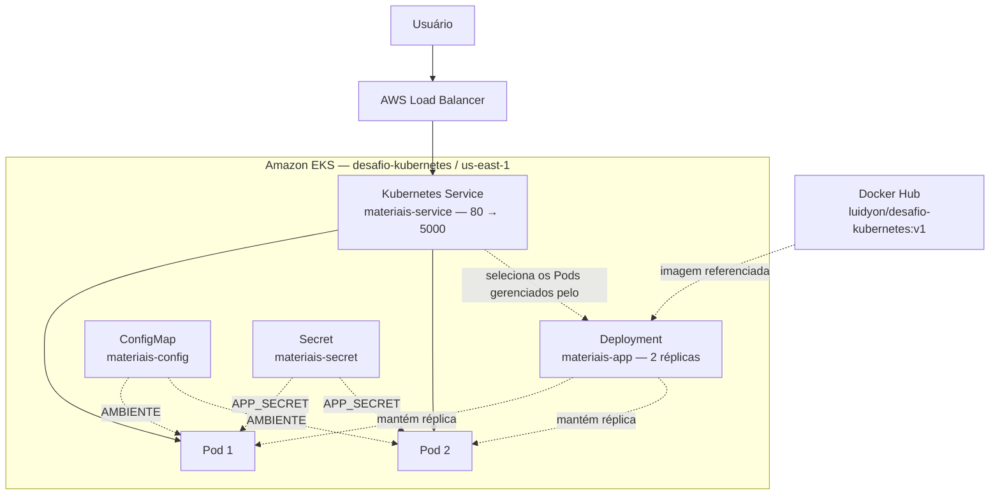
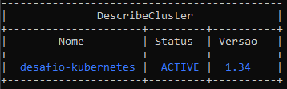
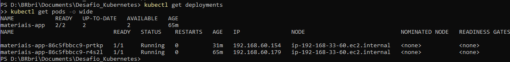
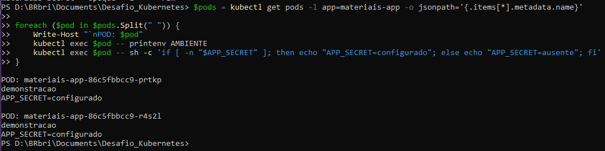
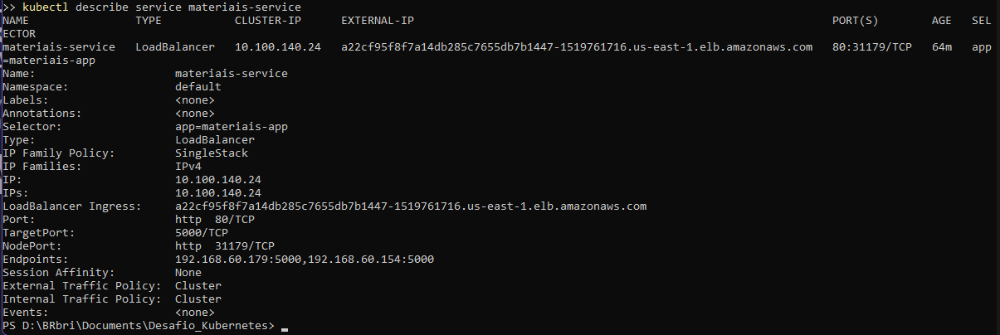

# Desafio Kubernetes — Da aplicação local ao Amazon EKS

Desafio Modular da disciplina **Computação em Nuvem e Orquestração com Kubernetes**.

**Estado atual:** Fases 1 e 2 concluídas. **Fase 3 — Amazon EKS: validação técnica CONCLUÍDA em 07/09/2026.**
O cluster e a aplicação foram consultados e testados entre 16:54 e 17:00 (UTC−03:00) de 07/09/2026. A documentação acadêmica foi consolidada com as oito capturas existentes e os registros textuais reais. A limpeza AWS foi concluída após os testes.

## Entrega acadêmica

**Universidade Salesiano Espírito Santo**

| Identificador | Integrante |
|---|---|
| 6924106557 | Luiz Gabriel de Oliveira Ferreira |
| 6924106421 | Yahn de Freitas Santos |
| 6924106679 | Davi dos Santos |

Entrega principal: [Desafio_Kubernetes.pdf](entrega/Desafio_Kubernetes.pdf), com **7 páginas de conteúdo e 4 de anexos**. O ZIP `entrega/Desafio_Kubernetes.zip` é somente um backup: contém o PDF e os arquivos essenciais, preservando a estrutura do projeto e excluindo `.git`, ambientes virtuais, caches e credenciais reais.

O self-healing e os testes HTTP externos foram documentados a partir de `fase3-comandos.txt`, sem criar capturas. A [conferência dos critérios](docs/conferencia-criterios.md) identifica a comprovação de cada item e as ressalvas documentais. O link do GitHub será informado separadamente no campo de texto da entrega.

## Objetivo

Demonstrar o fluxo de conteinerização e orquestração:

**Aplicação → Docker → Docker Hub → Amazon EKS → Deployment → Service → Acesso externo**

A aplicação funcional é propositalmente simples: uma API sobre materiais hospitalares, sem banco de dados nem regras de negócio. O foco do desafio é empacotar a aplicação com Docker, executá-la no Amazon EKS e gerenciar suas réplicas com Kubernetes.

## Aplicação

A aplicação usa **Python + Flask** e escuta na **porta 5000**.

| Item | Comportamento |
|---|---|
| `GET /` | Retorna o nome da aplicação, o ambiente, o status e a indicação de Secret configurado |
| `GET /health` | Retorna `{"status": "ok"}` para verificar a resposta da aplicação |
| `AMBIENTE` | Variável de ambiente; usa `local` como padrão e recebe `demonstracao` pelo ConfigMap no Kubernetes |
| `APP_SECRET` | Variável recebida em tempo de execução; a API informa apenas se ela foi definida |

**O conteúdo do Secret nunca é exposto nas respostas da aplicação.** Os exemplos deste repositório usam somente valores fictícios. A presença de `secret_configurado: true` no teste local confirma o recebimento de `APP_SECRET`, sem revelar seu conteúdo.

## Arquitetura

A arquitetura abaixo foi **efetivamente implantada e validada no Amazon EKS**. O cluster `desafio-kubernetes`, em `us-east-1`, possui um node `t3.small` no grupo `workers`; os dois Pods da aplicação estão nesse mesmo node.



O fluxo HTTP é **Usuário → AWS Load Balancer → Service → Pods**. O Deployment define as duas réplicas e gerencia o ReplicaSet responsável por mantê-las; ele não recebe tráfego HTTP. As setas pontilhadas representam relações de gerenciamento, seleção e configuração. Duas réplicas no mesmo node não demonstram tolerância à perda desse node.

## Estrutura do projeto

| Caminho | Descrição |
|---|---|
| `app/` | Código da aplicação (`app.py`) e dependência Flask (`requirements.txt`) |
| `k8s/` | Manifestos utilizados na implantação no Kubernetes |
| `k8s/configmap.yaml` | ConfigMap `materiais-config` com `AMBIENTE=demonstracao` |
| `k8s/secret.yaml` | Secret `materiais-secret` com o valor fictício `APP_SECRET=segredo-ficticio` |
| `k8s/deployment.yaml` | Imagem publicada, 2 réplicas, porta 5000 e referências ao ConfigMap e ao Secret |
| `k8s/service.yaml` | Service do tipo LoadBalancer, com porta 80 direcionada à porta 5000 dos Pods |
| `docs/evidencias/` | Capturas reais da atividade e índice das evidências |
| `docs/evidencias/fase3-comandos.txt` | Saídas reais, horários e resultados da validação técnica no EKS |
| `docs/roteiro-documentacao.md` | Base textual consolidada da documentação acadêmica |
| `docs/conferencia-criterios.md` | Mapeamento dos critérios, fontes e ressalvas de comprovação |
| `Dockerfile` | Receita da imagem, baseada em `python:3.12-slim` |
| `.dockerignore` | Exclusões do contexto de build Docker |
| `.gitignore` | Exclusões do versionamento, incluindo ambientes Python e arquivos sensíveis |
| `.gitattributes` | Normalização automática dos arquivos de texto |
| `README.md` | Estado do projeto, comandos, resultados e próximos passos |

## Fase 1 — Preparação da aplicação

**CONCLUÍDA.**

- Aplicação Flask criada com os endpoints `GET /` e `GET /health`.
- Dockerfile criado para instalar as dependências e iniciar a aplicação na porta 5000.
- ConfigMap e Secret fictício preparados para fornecer as variáveis de ambiente.
- Deployment preparado com 2 réplicas, labels e selectors `app: materiais-app`.
- Service LoadBalancer preparado para expor a porta 80 e encaminhar para a porta 5000.

A conclusão desta fase corresponde à preparação dos arquivos. Os manifestos também foram aplicados no EKS, com os resultados registrados na Fase 3.

### Execução local sem Docker — referência

Comandos para Windows/PowerShell, a partir da raiz do projeto:

```powershell
python -m venv .venv
.\.venv\Scripts\Activate.ps1
pip install -r app\requirements.txt

$env:AMBIENTE = "local"
$env:APP_SECRET = "valor-ficticio"
python app\app.py
```

Esta é uma alternativa de execução. As capturas desta atividade registram a validação local com Docker.

## Fase 2 — Docker e Docker Hub

**CONCLUÍDA.** A imagem foi construída, executada e publicada manualmente.

| Item | Valor |
|---|---|
| Imagem local | `desafio-kubernetes:v1` |
| Imagem publicada | `luidyon/desafio-kubernetes:v1` |
| Docker Hub | [luidyon/desafio-kubernetes](https://hub.docker.com/r/luidyon/desafio-kubernetes) |
| Tag | `v1` |

Uma **imagem Docker** reúne a aplicação e suas dependências. A **tag** identifica uma versão da imagem; neste projeto, `v1`. O **Docker Hub** é o registro que armazena a imagem publicada e a disponibiliza para download.

### Comandos usados

Registro dos comandos já executados em PowerShell, na raiz do projeto:

```powershell
docker build -t desafio-kubernetes:v1 .

docker run --rm -p 5000:5000 `
  -e AMBIENTE=local `
  -e APP_SECRET=valor-ficticio `
  desafio-kubernetes:v1
```

Com o container em execução, em outro terminal:

```powershell
docker images
docker ps

docker tag desafio-kubernetes:v1 luidyon/desafio-kubernetes:v1
docker push luidyon/desafio-kubernetes:v1
```

O comando de publicação está documentado como histórico da Fase 2. Nenhum novo push foi realizado nesta atualização do repositório.

## Resultados da validação local

Resultados da execução manual já concluída, conforme o relato da atividade e as capturas anexadas.

### GET /

Endereço: `http://localhost:5000/` — **HTTP 200**.

```json
{
  "ambiente": "local",
  "aplicacao": "Materiais Hospitalares",
  "secret_configurado": true,
  "status": "online"
}
```

`AMBIENTE` foi recebido como `local`. `APP_SECRET` também foi recebido, mas a resposta expõe somente a indicação booleana de que está configurado.

### GET /health

Endereço: `http://localhost:5000/health` — **HTTP 200**.

```json
{
  "status": "ok"
}
```

Para reproduzir a consulta e visualizar também o status HTTP, com a aplicação em execução:

```powershell
curl.exe -i http://localhost:5000/
curl.exe -i http://localhost:5000/health
```

As capturas do navegador mostram os corpos das respostas; o status HTTP 200 faz parte da validação manual informada. Essas evidências locais ainda não validam ConfigMap ou Secret dentro do Kubernetes.

## Evidências

As oito capturas originais foram analisadas e preservadas em [docs/evidencias](docs/evidencias/README.md). A captura do terminal reúne a listagem de imagens, o container em execução e o push; ela é apresentada uma única vez.

### Aplicação executada localmente


Comprova a resposta da aplicação na porta 5000, com `ambiente: local` e `secret_configurado: true`, sem expor o segredo.

### Health check


Comprova que `GET /health` respondeu com `status: ok` no ambiente local.

### Imagem, container e push Docker


Comprova a imagem `desafio-kubernetes:v1`, o container em execução com a porta 5000 publicada, a tag `luidyon/desafio-kubernetes:v1` e o push concluído com digest.

### Publicação no Docker Hub


Comprova a presença da tag `v1` no repositório `luidyon/desafio-kubernetes` do Docker Hub.

### Cluster Amazon EKS



Comprova o cluster `desafio-kubernetes` em estado `ACTIVE`. Apesar do nome do arquivo, a imagem não mostra o node Ready; essa comprovação está nas seções 1 e 8 de `fase3-comandos.txt`.

### Deployment e duas réplicas



Comprova `materiais-app` com `READY 2/2`, `AVAILABLE 2` e os Pods `prtkp` e `r4s2l` em execução. Os nomes completos permanecem visíveis na captura.

### Variáveis nos dois Pods



Comprova as variáveis recebidas pelos dois Pods sem revelar o conteúdo do Secret. A listagem dos objetos ConfigMap e Secret está documentada separadamente na seção 2 do registro textual.

### Service LoadBalancer



Comprova o tipo LoadBalancer, o hostname externo, a porta 80, o destino 5000 e os endpoints após a recuperação.

### Evidências textuais e rastreabilidade

O arquivo [fase3-comandos.txt](docs/evidencias/fase3-comandos.txt) registra consultas reais ao cluster, validação segura das variáveis, quatro respostas HTTP 200 e o self-healing com nomes e horários. A seção 7 contém o antes, a exclusão única e a recuperação; a seção 8 contém a confirmação final.

Esse registro histórico foi preservado integralmente, inclusive as observações sobre documentação pendente na data da coleta. A presente entrega resolve a consolidação documental usando as evidências existentes. Não foram criadas capturas de HTTP externo ou self-healing; as saídas reais foram apresentadas como texto no PDF.

As saídas integrais de `docker build` e `docker run` e os cabeçalhos HTTP locais continuam sem registro próprio. A imagem, o container, os corpos JSON locais e a publicação estão comprovados pelas capturas disponíveis. As ressalvas e os critérios correspondentes constam da [conferência](docs/conferencia-criterios.md).

## Fase 3 — Amazon EKS

**VALIDAÇÃO TÉCNICA CONCLUÍDA.** A criação e a aplicação dos recursos haviam sido realizadas manualmente. Nesta execução, o estado foi consultado novamente, as configurações e os endpoints foram testados, e apenas um Pod foi excluído para comprovar sua recriação automática. Os YAMLs e a quantidade de réplicas não foram alterados.

### Ambiente e estado verificado

| Item | Resultado observado em 07/09/2026 |
|---|---|
| AWS CLI | Autenticação confirmada para `desafio-kubernetes-admin`; identificador da conta omitido |
| kubectl | Contexto `desafio-kubernetes-admin@desafio-kubernetes.us-east-1.eksctl.io`, namespace `default` |
| Cluster | `desafio-kubernetes`, região `us-east-1`, estado `ACTIVE` |
| Node group | `workers` |
| Node | `ip-192-168-33-60.ec2.internal`, `Ready`, tipo `t3.small` |
| Quantidade de nodes | 1 |
| ConfigMap | `materiais-config`, existente e aplicado |
| Secret | `materiais-secret`, tipo `Opaque`, existente e aplicado; conteúdo não consultado |
| Deployment | `materiais-app`, imagem `luidyon/desafio-kubernetes:v1`, `READY 2/2`, `AVAILABLE 2` |
| Pods finais | `materiais-app-86c5fbbcc9-prtkp` e `materiais-app-86c5fbbcc9-r4s2l`, ambos `1/1 Running` |
| Configuração nos dois Pods finais | `AMBIENTE=demonstracao` e `APP_SECRET=configurado`, sem revelar o conteúdo do Secret |
| Service | `materiais-service`, tipo `LoadBalancer`, porta `80`, `targetPort: 5000` |
| Endpoints finais | `192.168.60.154:5000` e `192.168.60.179:5000` |

O Service retornou o hostname abaixo tanto na consulta inicial quanto na confirmação final:

```text
a22cf95f8f7a14db285c7655db7b1447-1519761716.us-east-1.elb.amazonaws.com
```

Esse é o endereço **observado nesta validação**. Em consultas posteriores, obter novamente o hostname do Service em vez de assumir que permaneceu igual.

### Comandos e validação das configurações

Os comandos completos e suas saídas estão em [fase3-comandos.txt](docs/evidencias/fase3-comandos.txt). Todas as operações Kubernetes desta execução usaram explicitamente o contexto do cluster e o namespace `default`. Exemplo de consulta segura, em PowerShell:

```powershell
$contexto = 'desafio-kubernetes-admin@desafio-kubernetes.us-east-1.eksctl.io'
kubectl --context $contexto -n default get nodes
kubectl --context $contexto -n default get deployment materiais-app
kubectl --context $contexto -n default get pods -l app=materiais-app -o wide
kubectl --context $contexto -n default get service materiais-service
kubectl --context $contexto -n default get configmap materiais-config
kubectl --context $contexto -n default get secret materiais-secret
kubectl --context $contexto -n default describe service materiais-service
kubectl --context $contexto -n default exec deployment/materiais-app -- printenv AMBIENTE

$verificarSecret = "import os; print('APP_SECRET=configurado' if os.environ.get('APP_SECRET') else 'APP_SECRET=ausente')"
kubectl --context $contexto -n default exec deployment/materiais-app -- python -c $verificarSecret
```

A consulta ao Secret listou apenas seus metadados; o teste dentro dos containers imprimiu somente sua presença. A configuração foi reconfirmada individualmente nos dois Pods finais, incluindo o substituto.

### Acesso externo e health check

Os dois endpoints responderam **HTTP 200 OK antes e depois do teste de recuperação**:

| Endpoint | Resposta observada |
|---|---|
| `GET /` | `{"ambiente":"demonstracao","aplicacao":"Materiais Hospitalares","secret_configurado":true,"status":"online"}` |
| `GET /health` | `{"status":"ok"}` |

Para novas consultas de leitura, obter o endereço diretamente do Kubernetes:

```powershell
$endereco = kubectl --context $contexto -n default get service materiais-service -o 'jsonpath={.status.loadBalancer.ingress[0].hostname}'
Invoke-WebRequest -Uri "http://$endereco/" -TimeoutSec 20 -MaximumRedirection 0 | Select-Object StatusCode, Content
Invoke-WebRequest -Uri "http://$endereco/health" -TimeoutSec 20 -MaximumRedirection 0 | Select-Object StatusCode, Content
```

### Recuperação automática dos Pods — resultado real

A propriedade dos Pods foi conferida pela cadeia **Deployment → ReplicaSet → Pods** antes da exclusão. Às 16:58:12 (UTC−03:00), foi iniciada a exclusão de **apenas** `materiais-app-86c5fbbcc9-mpvpb`, com `kubectl delete pod` e `--wait=false`. O segundo Pod foi preservado.

| Momento | Pods observados |
|---|---|
| Antes | `materiais-app-86c5fbbcc9-mpvpb` e `materiais-app-86c5fbbcc9-r4s2l`, ambos `1/1 Running` |
| Durante | Novo Pod `materiais-app-86c5fbbcc9-prtkp` em `1/1 Running`; o excluído ainda aparecia como `Terminating` |
| Depois | `materiais-app-86c5fbbcc9-prtkp` e `materiais-app-86c5fbbcc9-r4s2l`, ambos `1/1 Running`; o excluído não estava mais listado |

- **Aproximadamente 4,6 segundos:** primeira observação de dois Pods ativos `1/1 Running`, incluindo o substituto.
- **Aproximadamente 34,2 segundos:** confirmação de exatamente dois Pods totais, ambos prontos, após o encerramento do Pod excluído.
- **Estado final:** Deployment `READY 2/2`, `AVAILABLE 2`; dois Pods `1/1 Running`.

Os tempos incluem a latência das consultas e intervalos de espera de 2 segundos. O teste comprova a reposição de um Pod; não mede disponibilidade contínua durante a exclusão. Como o Deployment define `replicas: 2`, seu ReplicaSet reconcilia o estado atual com o desejado e cria o substituto.

O teste está registrado na seção 7 da evidência textual. Os excertos do antes, da exclusão e do resultado foram incorporados ao PDF como saída de comandos, sem criar screenshots ou repetir o teste.

### Custos e remoção dos recursos

**CONCLUÍDA.** Após os testes, `eksctl delete cluster` terminou com `all cluster resources were deleted`. A consulta `eksctl get cluster --region us-east-1` retornou `No clusters found`. Não restaram instâncias EC2 vinculadas ao cluster, Classic Load Balancers ou ELBv2. A Access Key temporária e o usuário/perfil IAM temporário do laboratório também foram removidos.

Os recursos AWS foram removidos após a coleta dos testes e das evidências.

**Recursos AWS removidos e limpeza confirmada.**

## Checklist

O checklist distingue a conclusão técnica das pendências de entrega e limpeza.

- [x] Aplicação executada localmente
- [x] GET / local
- [x] GET /health local
- [x] docker build
- [x] docker run
- [x] docker images
- [x] docker ps
- [x] imagem publicada no Docker Hub
- [x] AWS CLI configurada e autenticação confirmada
- [x] kubectl configurado para o cluster correto
- [x] cluster EKS criado e ACTIVE
- [x] kubectl get nodes — node Ready
- [x] ConfigMap aplicado
- [x] Secret aplicado
- [x] Deployment aplicado no EKS
- [x] 2 Pods em execução no EKS
- [x] Service LoadBalancer criado
- [x] endereço externo funcionando
- [x] GET / externo — HTTP 200
- [x] GET /health externo — HTTP 200
- [x] ConfigMap validado nos dois Pods finais
- [x] Secret validado nos dois Pods finais, sem revelar o conteúdo
- [x] apenas um Pod excluído manualmente
- [x] novo Pod recriado automaticamente
- [x] Deployment e dois Pods confirmados após a recuperação
- [x] evidências textuais da Fase 3 salvas
- [x] oito capturas existentes analisadas e organizadas
- [x] documentação acadêmica final consolidada com capturas e registros textuais
- [x] PDF principal e ZIP de backup preparados
- [x] custos e limpeza AWS conferidos após os testes
- [x] recursos AWS removidos após a validação

## Documentação acadêmica final

O [PDF principal](entrega/Desafio_Kubernetes.pdf) consolida a aplicação, Docker e Docker Hub, EKS, arquitetura, réplicas, configurações, acesso externo, self-healing, dificuldades, aprendizados, custos e conclusão. O [roteiro acadêmico](docs/roteiro-documentacao.md) foi atualizado como base textual, e a [conferência dos critérios](docs/conferencia-criterios.md) apresenta a cobertura e as ressalvas.

**Limitações:** aplicação didática, sem regras de negócio nem persistência; apenas um node para as duas réplicas; testes pontuais de HTTP e substituição de um Pod. Não foram executados testes de carga, falha do node ou disponibilidade contínua.
