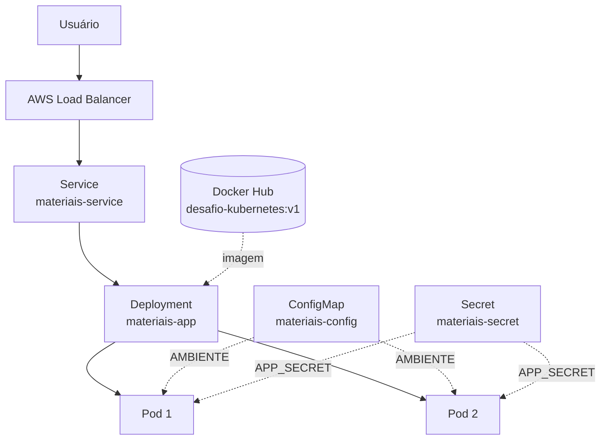

# Desafio Kubernetes

Desafio Modular da disciplina **Computação em Nuvem e Orquestração com Kubernetes**.

## Objetivo

Demonstrar, da forma mais simples possível, o fluxo completo de conteinerização e implantação:

**Aplicação → Docker → Docker Hub → Amazon EKS → Deployment → Service → Acesso externo**

A aplicação é uma API HTTP mínima em Python/Flask, com tema de materiais utilizados em procedimentos hospitalares. Ela não possui banco de dados nem regras de negócio: o foco é comprovar os conceitos de Docker e Kubernetes.

## Arquitetura



## Estrutura do projeto

| Arquivo | Descrição |
|---|---|
| `app/app.py` | Aplicação Flask com os endpoints `GET /` e `GET /health` |
| `app/requirements.txt` | Dependências Python (apenas Flask) |
| `Dockerfile` | Receita para gerar a imagem Docker da aplicação |
| `.dockerignore` | Arquivos que não entram na imagem |
| `.gitignore` | Arquivos que não são versionados (venv, arquivos sensíveis etc.) |
| `k8s/configmap.yaml` | ConfigMap com a variável não sensível `AMBIENTE=demonstracao` |
| `k8s/secret.yaml` | Secret com o valor **fictício** `APP_SECRET=segredo-ficticio` |
| `k8s/deployment.yaml` | Deployment com 2 réplicas, referenciando ConfigMap e Secret |
| `k8s/service.yaml` | Service do tipo LoadBalancer expondo a porta 80 → 5000 |

### Endpoints

`GET /`

```json
{
  "aplicacao": "Materiais Hospitalares",
  "status": "online",
  "ambiente": "demonstracao",
  "secret_configurado": true
}
```

`GET /health`

```json
{ "status": "ok" }
```

- `AMBIENTE` vem de variável de ambiente; se não existir, o padrão é `local`.
- `APP_SECRET` é o segredo fictício. A API **nunca retorna o valor**, apenas informa se ele está configurado.

## Execução local sem Docker

Comandos para Windows/PowerShell:

```powershell
python -m venv .venv
.\.venv\Scripts\Activate.ps1
pip install -r app\requirements.txt

$env:AMBIENTE = "local"
$env:APP_SECRET = "valor-ficticio"
python app\app.py
```

Em outro terminal, teste os endpoints:

```powershell
Invoke-RestMethod http://localhost:5000/
Invoke-RestMethod http://localhost:5000/health
```

Ou com curl:

```powershell
curl.exe http://localhost:5000/
curl.exe http://localhost:5000/health
```

## Execução com Docker

Substitua `<DOCKERHUB_USUARIO>` pelo seu usuário do Docker Hub.

```powershell
# Gerar a imagem
docker build -t <DOCKERHUB_USUARIO>/desafio-kubernetes:v1 .

# Executar o container
docker run --rm -p 5000:5000 `
  -e AMBIENTE=local `
  -e APP_SECRET=valor-ficticio `
  <DOCKERHUB_USUARIO>/desafio-kubernetes:v1

# Evidências
docker images
docker ps
```

Teste em `http://localhost:5000/` e `http://localhost:5000/health`.

## Publicação no Docker Hub

Conceitos:

- **Imagem**: pacote imutável com a aplicação e suas dependências.
- **Tag**: identificador de versão da imagem (aqui, `v1`).
- **Registro**: repositório remoto de imagens (Docker Hub) de onde o cluster faz o download.

```powershell
docker login
docker push <DOCKERHUB_USUARIO>/desafio-kubernetes:v1
```

## Kubernetes

Antes de aplicar, edite `k8s/deployment.yaml` e substitua `<DOCKERHUB_USUARIO>` pelo seu usuário.

```powershell
kubectl apply -f k8s/configmap.yaml
kubectl apply -f k8s/secret.yaml
kubectl apply -f k8s/deployment.yaml
kubectl apply -f k8s/service.yaml

kubectl get deployments
kubectl get pods
kubectl get services
```

O campo `EXTERNAL-IP` do Service exibirá o endereço do Load Balancer (pode levar alguns minutos). Acesse:

```
http://<EXTERNAL-IP>/
http://<EXTERNAL-IP>/health
```

A resposta de `GET /` deve mostrar `"ambiente": "demonstracao"` (ConfigMap) e `"secret_configurado": true` (Secret).

### Fluxo de acesso

Usuário → AWS Load Balancer → Service → Deployment → Pods

### Recuperação automática (self-healing)

Liste os Pods, exclua um deles manualmente e liste novamente:

```powershell
kubectl get pods
kubectl delete pod <NOME_DO_POD>
kubectl get pods
```

O Deployment detecta que há menos réplicas em execução do que o desejado (2) e cria um novo Pod automaticamente.

## Amazon EKS

> Seção de preparação. Nenhum recurso AWS é criado neste repositório; o cluster será provisionado por roteiro guiado.

Após o cluster existir, configure o `kubectl` e valide o acesso:

```powershell
aws eks update-kubeconfig --region <REGIAO> --name <NOME_DO_CLUSTER>
kubectl get nodes
```

Depois, siga os comandos da seção **Kubernetes**.

### Remoção dos recursos (evitar custos)

O Service do tipo LoadBalancer cria um Load Balancer real na AWS, que gera custo. Após coletar as evidências:

```powershell
kubectl delete -f k8s/service.yaml
kubectl delete -f k8s/deployment.yaml
kubectl delete -f k8s/secret.yaml
kubectl delete -f k8s/configmap.yaml
```

Em seguida, remova o cluster EKS conforme o roteiro guiado.

## Evidências para o trabalho

- [ ] Aplicação rodando localmente
- [ ] GET / funcionando
- [ ] GET /health funcionando
- [ ] docker build
- [ ] docker run
- [ ] docker images
- [ ] docker ps
- [ ] imagem publicada no Docker Hub
- [ ] kubectl get nodes
- [ ] Deployment aplicado
- [ ] 2 Pods em execução
- [ ] Service LoadBalancer criado
- [ ] endereço externo funcionando
- [ ] ConfigMap recebido
- [ ] Secret configurado
- [ ] Pod excluído manualmente
- [ ] novo Pod recriado automaticamente
- [ ] recursos AWS removidos após os testes
